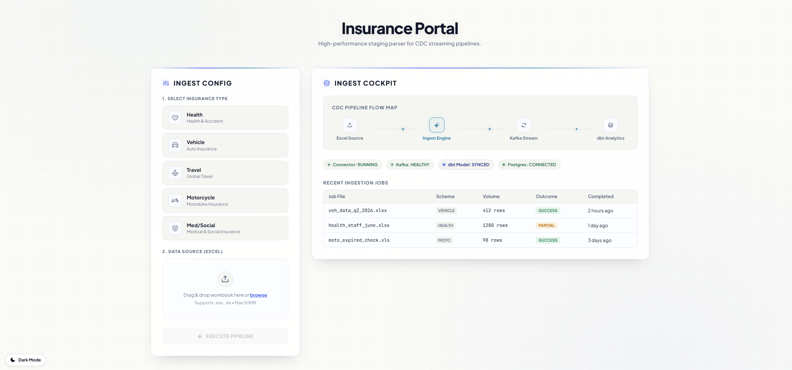
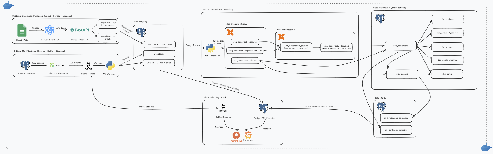
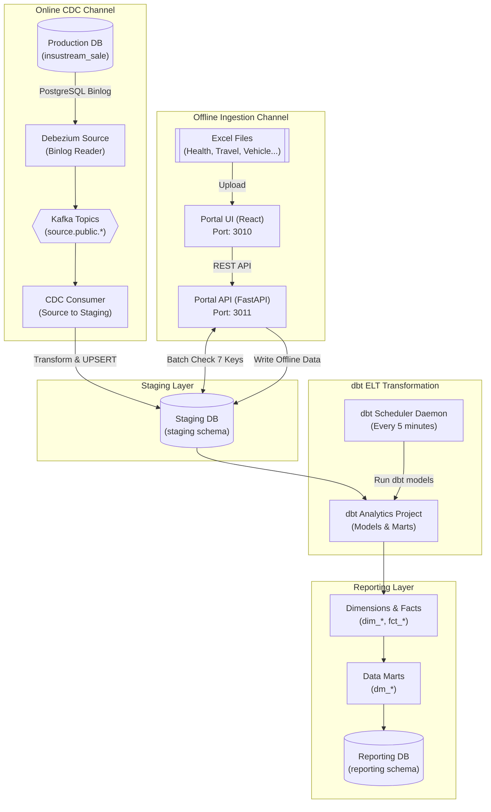
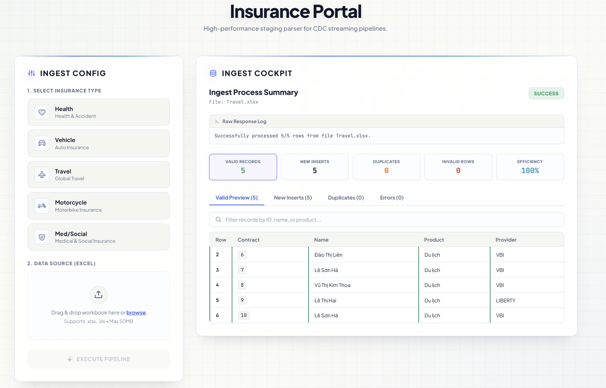
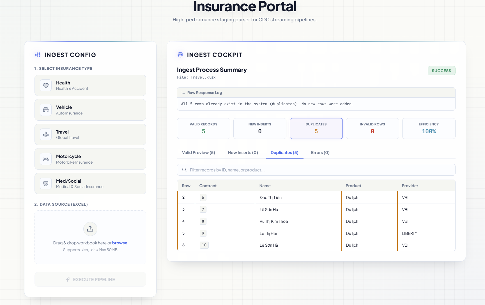
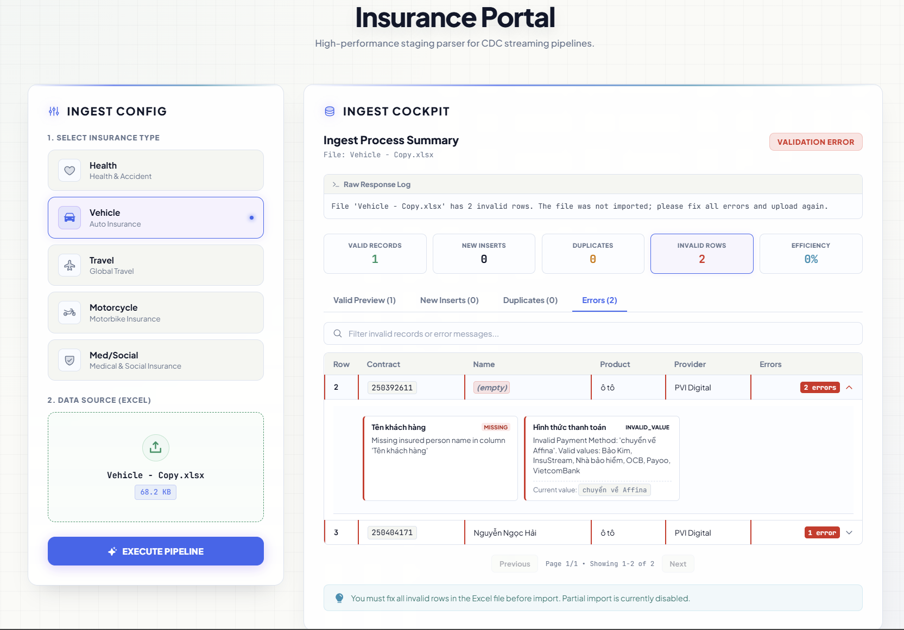

<div>
  
</div>

<div align="center">
  <strong>English</strong> | <a href="README_VI.md">Tiếng Việt</a>
</div>

<h3 align="center">Enterprise Data Engineering Platform combining real-time CDC and offline Excel batch ingestion</h3>

<div align="center">
  
  
  
  
  
  
</div>

---

## Table of Contents

1. [Project Overview](#project-overview)
2. [System Architecture & Data Flow](#system-architecture--data-flow)
3. [Core Features](#core-features)
4. [Tech Stack](#tech-stack)
5. [Directory Structure](#directory-structure)
6. [Quick Start Guide](#quick-start-guide)
7. [Monitoring & Logs](#monitoring--logs)
8. [Troubleshooting](#troubleshooting)

---

## Project Overview

This project implements a **Hybrid Data Ingestion & Streaming ETL Platform** designed for managing insurance contracts. The system seamlessly integrates two fundamentally different data channels:
1. **Online Real-time CDC (Change Data Capture)**: Automatically captures data change events (INSERT, UPDATE, DELETE) directly from the production database of the sales system.
2. **Offline Batch Ingestion Portal**: Allows partners or administrators to manually upload raw contract reports via Excel files.

The core objective is to automate data collection, perform cross-deduplication, standardize, and build a centralized analytical data warehouse (**Star Schema**), providing the enterprise with a comprehensive and accurate view of its business operations.

### Portal Management Interface (Excel Upload UI)


---

## System Architecture & Data Flow

The architecture is fully containerized using Docker, ensuring a smooth data flow from source systems to the reporting layer.

### Project Workflow


### Ingestion & Transformation Pipeline


---

## Core Features

### 1. Excel Processing using Design Patterns
The Portal Backend is built with FastAPI applying strict Object-Oriented Design patterns:
*   **Factory Pattern (`ProcessorFactory`)**: Identifies the insurance type from the uploaded file to initialize the specific processor.
*   **Strategy Pattern (`IInsuranceProcessor`)**: Standardizes data structure and types independently for each business domain (Motorcycle, Vehicle, Health, Travel...).
*   **Template Method Pattern**: Fixes the 4-step processing workflow: `parse_excel()` $\rightarrow$ `pre_process()` $\rightarrow$ `transform()` $\rightarrow$ `post_process()`.

### 2. Cross-Deduplication Mechanism (SQL & dbt)
To prevent manually uploaded data (Offline Excel) from overwriting official data (Online CDC) based on the **Online Wins** principle:
*   **At API Level (Staging)**: The Portal Backend queries the Staging database directly to check for duplicates via batch queries. If the 7 core business keys match, the record is discarded early.
*   **At dbt Level (ELT)**: The `int_contracts_deduped.sql` model uses the `ROW_NUMBER() OVER (PARTITION BY 7_business_keys ORDER BY online_first)` window function as a final deduplication filter, prioritizing online data streams.

The 7 core business keys:
```
{contractId} + {peopleName} + {majorName} + {companyProviderName} + {startDate} + {endDate} + {feeInsurance}
```

### 3. Visualized Excel Upload Status
The system visually displays different scenarios of data processing results on the Portal UI:

````carousel

<!-- slide -->

<!-- slide -->

````

---

## Tech Stack

### Frontend
<div align="left">
  
  
  
  
  
</div>

*   **React 18 & TypeScript**: Component-driven UI development, robust upload state management.
*   **Tailwind CSS & Vanilla CSS**: Modern, responsive, and intuitive interface.

### Analytics & Backend
<div align="left">
  
  
  
  
  
  
  
  
  
  
  
  
  
  
  
</div>

*   **FastAPI & SQLAlchemy ORM**: Handles incoming Excel files via asynchronous data streams.
*   **Kafka & Debezium**: Captures and tracks data changes directly from the source database.
*   **dbt Core**: Executes incremental ELT models to normalize data into a Star Schema.
*   **PostgreSQL 16**: Serves as the Production DB, Staging DB, and Reporting Data Warehouse.

---

## Directory Structure

```
hybrid-data-ingestion-platform/
├── configs/                     # Debezium connectors registration configs
├── database/                    # SQL scripts for DB initialization (Staging, Reporting)
├── docs/                        # System specifications and guides
│   ├── images/                  # UI and workflow images
│   ├── PROJECT_FLOW.md          # Detailed data flow documentation
│   └── SYSTEM_WORKFLOW.md       # Overall business logic and diagram
├── services/                    # Independent system services
│   ├── cdc_consumer/            # Syncs DB Source -> DB Staging via Kafka
│   ├── dbt_analytics/           # dbt Project (Transformations, DWH, Data Marts)
│   ├── shared/                  # Shared Python libraries (logger, db connections)
│   ├── portal_backend/          # FastAPI Backend receiving offline Excel files
│   └── portal_frontend/         # React + TypeScript Frontend
├── docker-compose.kafka.yml     # Manages Zookeeper, Kafka, and Kafka-UI
├── docker-compose.debezium.yml  # Manages Debezium Connect and Debezium-UI
├── docker-compose.consumer.yml  # Manages CDC Consumer
├── docker-compose.scheduler.yml # Manages dbt Scheduler Daemon
├── docker-compose.portal.yml    # Manages Portal Frontend & Backend
├── .env.example                 # Environment variables template
└── README.md                    # Project overview and run instructions (this file)
```

---

## Quick Start Guide

### Prerequisites
*   **Docker** and **Docker Compose** installed.
*   A running PostgreSQL database system (or via Docker).

### Step 1: Copy Environment File
1. Copy the environment configuration template:
   ```powershell
   # Windows (PowerShell)
   Copy-Item .env.example .env
   
   # macOS/Linux (Bash)
   cp .env.example .env
   ```
2. Update the database and Kafka connection parameters to fit your environment.

### Step 2: Create Shared Docker Network
Initialize an internal network shared across the project stack:
```bash
docker network create cdc-network
```

### Step 3: Launch Infrastructure
```bash
# 1. Start databases (Source & Target)
docker compose -f docker-compose.db.yml up -d

# 2. Start Kafka Cluster & UI
docker compose -f docker-compose.kafka.yml up -d

# 3. Start Debezium Connector
docker compose -f docker-compose.debezium.yml up -d
```
*Wait about 15-20 seconds for the services to fully initialize.*

### Step 4: Register Debezium Connectors
Push the JSON configuration files to register table change tracking to Debezium:
```powershell
# Windows (PowerShell)
Invoke-RestMethod -Uri "http://localhost:8083/connectors" `
  -Method Post `
  -ContentType "application/json" `
  -Body (Get-Content configs\register-source-connector.json -Raw)
```

### Step 5: Start Services & Portal
```bash
# 1. Start CDC Consumer (Kafka -> Staging DB)
docker compose -f docker-compose.consumer.yml up -d --build

# 2. Start dbt Scheduler (Runs dbt transform every 5 minutes)
docker compose -f docker-compose.scheduler.yml up -d --build

# 3. Start Portal FE & BE
docker compose -f docker-compose.portal.yml up -d --build
```

---

## Monitoring & Logs

The system provides visual interfaces for developers to manage data and event streams:
*   **System Logs**: `docker compose -f docker-compose.<service>.yml logs -f`
*   **Kafka-UI**: Visit [http://localhost:8080](http://localhost:8080) to monitor topics and consumer groups.
*   **Debezium-UI**: Visit [http://localhost:8084](http://localhost:8084) to check connector operational status.
*   **Portal UI**: Visit [http://localhost:3010](http://localhost:3010) to execute Excel file uploads.
*   **Portal Swagger Docs**: View API specs and test endpoints at [http://localhost:3011/docs](http://localhost:3011/docs).

---

## Troubleshooting

*   **Error: `Debezium Connector fails to run (FAILED)`**
    *   *Cause:* The source database (`insure_production`) is not configured with `wal_level` set to `logical`.
    *   *Fix:* Execute the SQL command `ALTER SYSTEM SET wal_level = 'logical';` on the source database and restart it.
*   **Error: `Consumer not receiving messages from Kafka`**
    *   *Cause:* Network mismatch in `cdc-network` or incorrect Kafka bootstrap server mapping between the container environment and localhost.
    *   *Fix:* Ensure the `KAFKA_BOOTSTRAP_SERVERS` variable in `.env` is set to `kafka:9093` for containers and `localhost:9092` for processes running directly on the host machine.
*   **Local code changes are not reflected in the container?**
    *   *Fix:* Re-run docker compose with the build flag to recompile the image: `docker compose -f docker-compose.<name>.yml up -d --build`.

---

<div>
  
</div>
