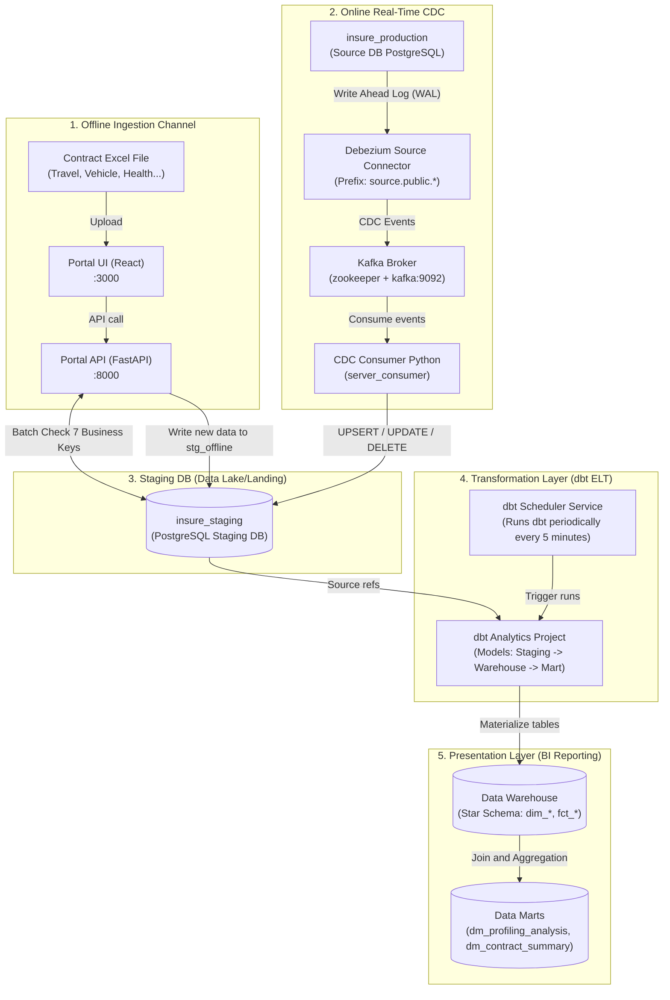

# Project Architecture & Data Flow

The **Hybrid Data Ingestion & Streaming ETL Platform** is a modern data platform that integrates real-time online data streaming (Online CDC) and offline batch data ingestion (Offline Excel Upload). The project adopts the **Modern Data Stack (MDS)** model using **dbt** to normalize data into a **Star Schema (Dimensional Modeling)** structure.

---

## 1. Overall Architecture Flow

Below is the data flow architecture from source systems to the reporting data warehouse:



---

## 2. Core Technical Components

### 2.1. Online CDC & Consumer
- **Debezium**: Monitors changes (INSERT, UPDATE, DELETE) in the production database (`insure_production`) via WAL files, converts them into standardized JSON messages, and publishes them to the corresponding Kafka topics.
- **Python CDC Consumer**: Listens to Kafka topics, reformats the Debezium JSON payloads (such as converting epoch timestamps), and writes directly into the staging tables.

### 2.2. Offline Ingestion & Cross-Channel Deduplication
- **Portal App (React/FastAPI)**: Enables manual uploads of offline Excel contract reports from partners.
- **"Online Wins" Principle**: Data from the primary transactional system (Online) always takes precedence over manually uploaded batch data (Offline).
- **7 Business Keys Deduplication via SQL and dbt**: To prevent duplicate data between the two ingestion paths, the system uses 7 business keys to construct a unique identifier:
  1. `contractId` (Contract identifier)
  2. `peopleName` (Insured person name)
  3. `majorName` (Insurance major program name)
  4. `companyProviderName` (Insurance provider)
  5. `startDate` (Policy start date)
  6. `endDate` (Policy end date)
  7. `feeInsurance` (Insurance fee)

Deduplication occurs at two distinct stages:
1. **At API Level (Staging)**: The Portal Backend uses `DuplicateService` to query the PostgreSQL Staging database directly via batch queries. If an uploaded record matches any existing record via the 7 Business Keys, it is filtered out before hitting the `stgInsuranceContractObjectOffline` table.
2. **At dbt Level (ELT Cross-Channel)**: The intermediate dbt model `int_contracts_deduped.sql` performs a `UNION ALL` of the Online and Offline tables, then applies the window function `ROW_NUMBER() OVER (PARTITION BY ... ORDER BY CASE WHEN source_type = 'online' THEN 1 ELSE 2 END ASC)` to filter out cross-channel duplicates, ensuring Online CDC data wins.

---

## 3. Data Warehouse Schema (Star Schema)

Once the raw data lands in Staging, **dbt** automatically triggers the ELT processes to transform the inconsistent wide tables into a **Star Schema** optimized for BI and analysis:

```
                  ┌─────────────────┐
                  │    dim_date     │
                  └────────┬────────┘
                           │ 1:N
                           ▼
  ┌─────────────────┐    ┌─────────────────┐    ┌───────────────────┐
  │  dim_customer   ├──1:N┤  fct_contracts  ├N:1┤dim_insured_person │
  └─────────────────┘    └────────┬────────┘    └───────────────────┘
                           N:1    │ N:1
  ┌─────────────────┐             ▼             ┌───────────────────┐
  │dim_sales_channel│◀────────────┴────────────▶│    dim_product    │
  └─────────────────┘                           └───────────────────┘
                                  ▲
                           1:N    │ 1:N
                         ┌────────┴────────┐
                         │   fct_claims    │
                         └─────────────────┘
```

### Dimension Tables
- `dim_date`: Statically generated date dimension covering 2020-2030, supporting time intelligence (day name, quarter, weekends, end of month).
- `dim_customer`: Information regarding the policyholder (Buyer).
- `dim_insured_person`: Information regarding the insured person, incorporating **city code decoding** and **family relationship** attributes.
- `dim_product`: Normalized packages, majors, and programs.
- `dim_sales_channel`: Intermediary distribution channels (agencies, sales branches).

### Fact Tables
- `fct_contracts`: Detailed insurance policy transactions mapped per target object (grain: 1 row = 1 contract object). Contains foreign keys pointing to dimension tables along with measures (Premium fee, commission, amount).
- `fct_claims`: Detailed policy claim events, containing medical diagnostic categorization (`common_diagnostic_category`) and claim processing duration.

### Presentation Layer (Data Marts)
- `dm_profiling_analysis`: Target mart for customer claim profiling and analytics.
- `dm_contract_summary`: Target mart for contract performance, premium sales, and revenue overview.
