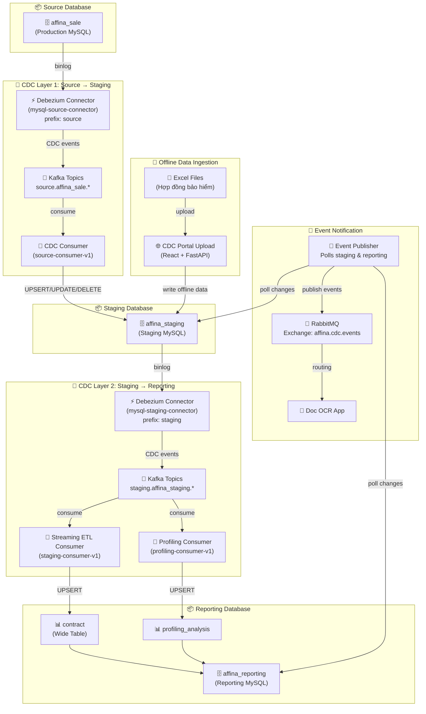
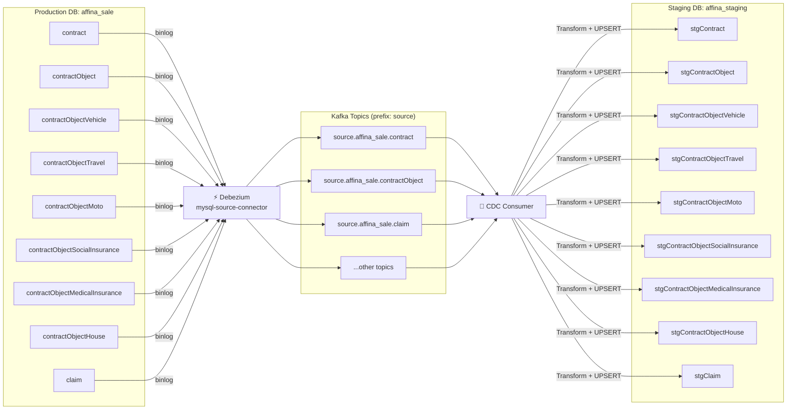
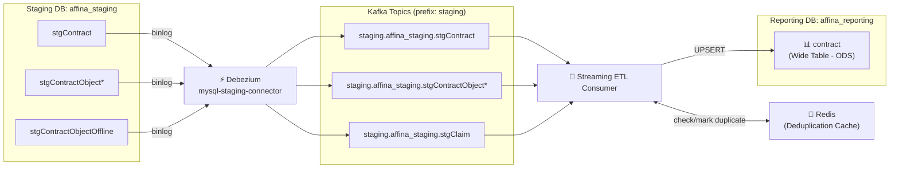
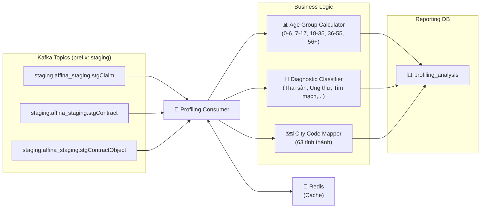
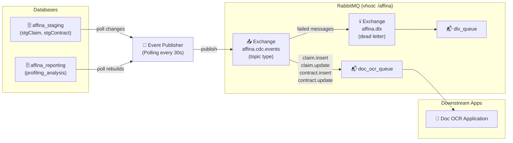
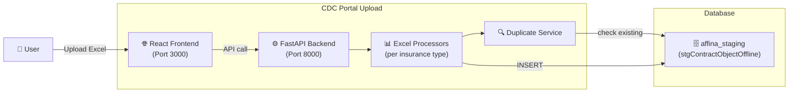
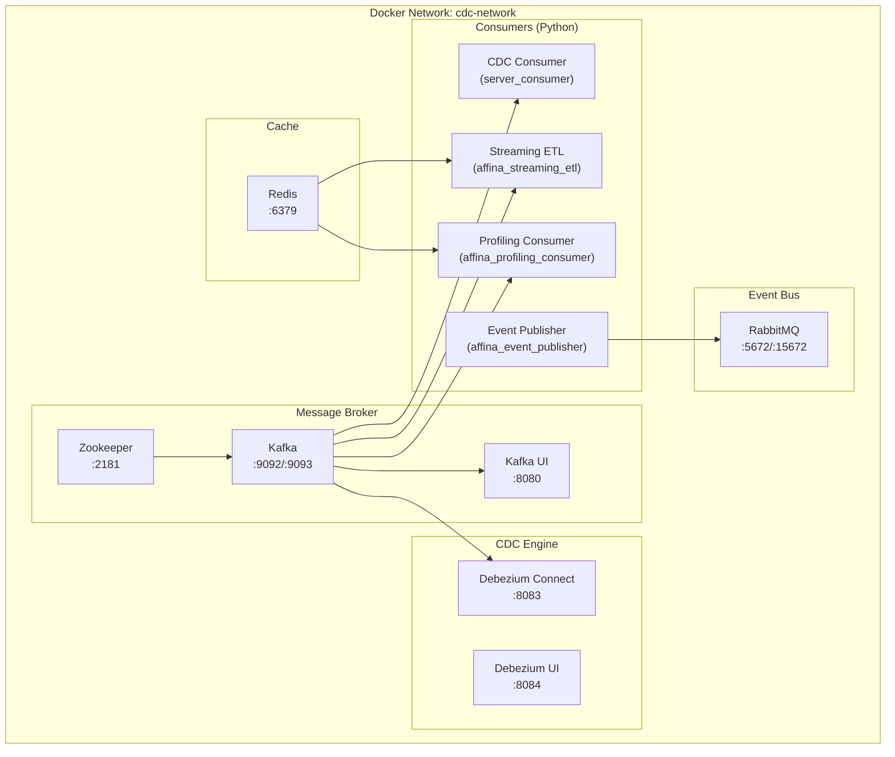
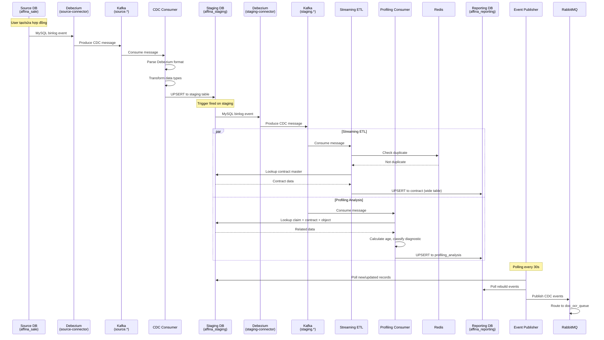
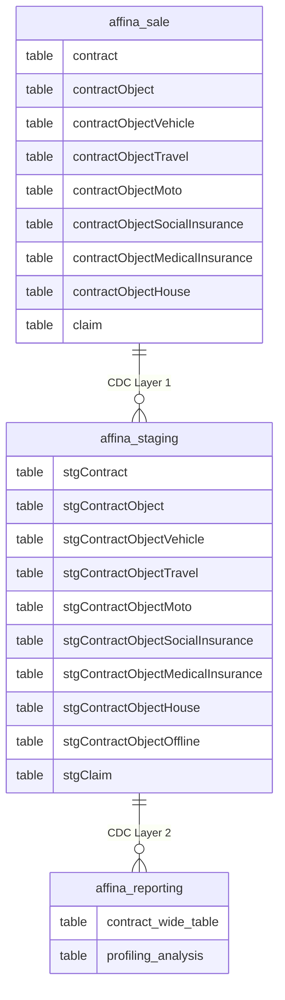

# CDC Reporting - Luồng Hoạt Động (System Flow)

## 1. Tổng Quan Kiến Trúc (Architecture Overview)



---

## 2. Luồng Chi Tiết Từng Giai Đoạn

### 2.1. Source → Staging (CDC Layer 1)



**Xử lý trong CDC Consumer:**
1. **Subscribe** Kafka topics `source.affina_sale.*`
2. **Parse** Debezium message → extract `operation` (c/r/u/d) + `data`
3. **Transform** đổi format Debezium → MySQL (datetime, date fields)
4. **Route** theo operation:
   - `c` (create) / `r` (snapshot) → **UPSERT** (INSERT ON DUPLICATE KEY UPDATE)
   - `u` (update) → **UPDATE** (separate UPDATE to fire triggers)
   - `d` (delete) → **DELETE**

---

### 2.2. Staging → Reporting (CDC Layer 2 - Streaming ETL)



**Xử lý trong Streaming ETL Consumer:**
1. **Subscribe** Kafka topics `staging.affina_staging.*`
2. **Identify** loại bảo hiểm từ topic (Vehicle, Travel, Moto, Health, Social Insurance, House)
3. **Check duplicate** qua Redis (key: `{insurance_type}:{contract_object_id}`, TTL: 7 ngày)
4. **Enrich** data: lookup contract master từ staging → gắn thêm thông tin (productName, paymentAmount, status...)
5. **Build** reporting record: merge contract + contract object → wide table format
6. **UPSERT** vào `affina_reporting.contract`

> **Insurance Types Supported:** Vehicle, Travel, Moto, Health (Medical Insurance), Social Insurance, House, Offline

---

### 2.3. Staging → Profiling Analysis (Real-time)



**Xử lý trong Profiling Consumer:**
1. **Nhận** CDC events từ stgClaim, stgContract, stgContractObject
2. **Lookup** related data: claim → contract → contractObject
3. **Tính toán** profiling fields:
   - **Age & Age Group** từ ngày sinh (dob)
   - **Diagnostic Category** phân loại chuẩn đoán bệnh
   - **City Name** từ city code
   - **Relationship** (Bản thân, Bố/Mẹ, Vợ/Chồng, Con,...)
4. **UPSERT** vào `affina_reporting.profiling_analysis`

---

### 2.4. Event Publisher → RabbitMQ (Downstream Notification)



**Routing Keys:**
| Routing Key | Mô tả |
|---|---|
| `claim.insert` | Claim mới được tạo |
| `claim.update` | Claim được cập nhật |
| `contract.insert` | Hợp đồng mới |
| `contract.update` | Hợp đồng được cập nhật |

---

### 2.5. Offline Data: Excel Upload Portal



**Insurance Types (Excel Upload):** Sức khỏe, Xe cơ giới, Du lịch, Tai nạn, Y tế Xã hội, Xe máy

---

## 3. Infrastructure Components



---

## 4. Data Flow Sequence (End-to-End)



---

## 5. Bảng Tóm Tắt Components

| Component | Container | Vai trò | Input | Output |
|---|---|---|---|---|
| **Debezium (Source)** | debezium-connect | Capture binlog từ Source DB | MySQL binlog | Kafka topics (source.*) |
| **Debezium (Staging)** | debezium-connect | Capture binlog từ Staging DB | MySQL binlog | Kafka topics (staging.*) |
| **CDC Consumer** | server_consumer | Route CDC events → Staging | Kafka (source.*) | affina_staging tables |
| **Streaming ETL** | affina_streaming_etl | Transform staging → reporting | Kafka (staging.*) | affina_reporting.contract |
| **Profiling Consumer** | affina_profiling_consumer | Build profiling analysis | Kafka (staging.*) | affina_reporting.profiling_analysis |
| **Event Publisher** | affina_event_publisher | Notify downstream apps | MySQL polling | RabbitMQ events |
| **CDC Portal** | frontend + backend | Upload Excel offline data | Excel files | affina_staging.stgContractObjectOffline |
| **Kafka** | server_kafka | Message broker | Debezium events | Consumer groups |
| **Redis** | redis | Deduplication cache | ETL/Profiling checks | Cache responses |
| **RabbitMQ** | rabbitmq | Event bus for downstream | Publisher events | Application queues |

---

## 6. Business Logic

### 6.1. Quy tắc xử lý CDC Event

| Operation | CDC Consumer (source→staging) | Streaming ETL (staging→reporting) |
|---|---|---|
| `c` (insert) | INSERT ON DUPLICATE KEY UPDATE | INSERT ON DUPLICATE KEY UPDATE |
| `r` (snapshot) | INSERT ON DUPLICATE KEY UPDATE | INSERT ON DUPLICATE KEY UPDATE |
| `u` (update) | UPDATE by PK | INSERT ON DUPLICATE KEY UPDATE |
| `d` (delete) | DELETE by PK | DELETE by `contractId` hoặc `contractObjectId` |

> **Lưu ý delete cascade**: Khi `stgContract` bị xóa → xóa **tất cả** rows có `contractId` đó trong `affina_reporting.contract`. Khi `stgContractObject*` bị xóa → xóa **một** row theo `contractObjectId`.

---

### 6.2. Wide Table Mapping (staging → reporting.contract)

Mỗi loại bảo hiểm có staging table riêng với tên field khác nhau. Streaming ETL normalize về cùng schema của `affina_reporting.contract`:

| Insurance Type | Staging Table | PK | Tên field người được BH |
|---|---|---|---|
| HEALTH | `stgContractObject` | `contractObjectId` | `peopleName`, `peopleDob`, `peopleGender` |
| VEHICLE | `stgContractObjectVehicle` | `contractObjectId` | `peopleName`, `peopleDob`, `peopleGender` |
| SOCIAL | `stgContractObjectSocialInsurance` | `contractObjectId` | `peopleName`, `peopleDob`, `peopleGender` |
| MEDICAL | `stgContractObjectMedicalInsurance` | `contractObjectId` | `peopleName`, `peopleDob`, `peopleGender` |
| TRAVEL | `stgContractObjectTravel` | `id` | `name`, `dob`, `gender` |
| MOTO | `stgContractObjectMoto` | `id` | `name`, `dob`, `gender` |
| HOUSE | `stgContractObjectHouse` | `id` | `name`, `dob`, `gender` |
| OFFLINE | `stgContractObjectOffline` | `offline_id` | `peopleName` hoặc `name` |

> **Key mapping rule**: Các bảng dùng PK là `id` (TRAVEL/MOTO/HOUSE) sẽ được map `id → contractObjectId` khi ghi vào reporting.

---

### 6.3. Profiling Analysis — Trường Tính Toán

`profiling_analysis` không lưu raw data mà lưu **kết quả đã tính toán** từ claim + contract + contractObject:

| Field | Nguồn | Logic |
|---|---|---|
| `age` | `stgContractObject.peopleDob` | `(today - dob).days // 365` |
| `age_group` | `age` | `0-6 / 7-17 / 18-35 / 36-55 / 56+` |
| `city` | `peopleCityCode` | Lookup map 63 tỉnh thành |
| `relationshipName` | `peopleRelationship` (int) | Lookup: 0=Bản thân, 1=Bố/Mẹ, 2=Vợ/Chồng, 3=Anh/Chị/Em, 4=Con, 5=Khác, 6=Bố/Mẹ vợ/chồng |
| `compensationRate` | `compensationAmount / amountClaim * 100` | Tỉ lệ bồi thường (%) |
| `days_from_contract_to_claim` | `claimStartDate - contractStartDate` | Số ngày từ hiệu lực HĐ đến ngày claim |
| `common_diagnostic_category` | `claim.diagnostic` (text) | Phân loại từ khóa: Thai sản / Nha khoa / Tim mạch / Ung thư / ... |
| `claimMonth` / `claimYear` | `claim.createdAt` | Tháng/năm để group phân tích |

**Trigger logic**: Consumer nhận event từ `stgClaim` → lookup `stgContract` + `stgContractObject` → build record. Khi `stgContract` hoặc `stgContractObject` update → refresh tất cả profiling records liên quan.

---

## 7. Redis Deduplication — Chi Tiết

### 7.1. Mục đích

Redis cache dùng để **ngăn offline Excel data ghi đè online CDC data** theo policy: **online wins**.

Khi user upload Excel, nếu record đó đã tồn tại trong CDC online (đã qua Debezium pipeline), record Excel sẽ bị skip — không insert vào `stgContractObjectOffline`.

---

### 7.2. Hai loại Redis key

**Loại 1 — Dedup cache cho offline upload** (build bởi `redis_cache_builder.py`):

```
Key:   contract:dedup:{contractId}:{name}:{majorName}:{companyProviderName}
Value: {"source": "online", "contractObjectId": "...", "insuranceType": "HEALTH", "modifiedAt": "...", "cachedAt": "..."}
TTL:   86400 giây (24 giờ)
```

Ví dụ:
```
contract:dedup:HD001:nguyen van a:bao hiem suc khoe:pvi
```

> **Chuẩn hóa**: `name`, `majorName`, `companyProviderName` đều được `.strip().lower()` trước khi build key → tránh miss match do khác hoa thường / khoảng trắng.

---

**Loại 2 — Processed marker cho Streaming ETL** (ghi bởi `streaming_etl_consumer.py`):

```
Key:   dedup:{insuranceType}:{contractObjectId}
Value: "1"
TTL:   604800 giây (7 ngày)
```

Ví dụ:
```
dedup:HEALTH:abc123-contractObjectId
```

> Key này đánh dấu record đã được xử lý bởi Streaming ETL. Dùng để tránh xử lý lại khi consumer restart và replay messages.

---

### 7.3. Flow kiểm tra duplicate

```
Excel Upload (Offline):
  record → build key: contract:dedup:{contractId}:{name}:{majorName}:{company}
         → Redis EXISTS?
              ├── YES → skip record (duplicate với online data)
              └── NO  → insert vào stgContractObjectOffline

Streaming ETL (Online):
  CDC event → check key: dedup:{insuranceType}:{contractObjectId}
            → Redis EXISTS?
                 ├── YES → skip (đã processed)
                 └── NO  → upsert vào reporting + SET key với TTL 7 ngày
```

---

### 7.4. Khi nào cần rebuild Redis cache?

Redis cache có thể bị stale hoặc mất data trong các tình huống sau — cần chạy lại `redis_cache_builder.py`:

| Tình huống | Hành động |
|---|---|
| Redis restart / data bị xóa | Rebuild full cache |
| Thêm lượng lớn data online mới vào staging | Rebuild để update cache |
| TTL hết hạn (sau 24h) và vẫn cần check | Rebuild hoặc tăng TTL |
| Lần đầu deploy hệ thống | Bắt buộc rebuild trước khi cho phép upload offline |

Lệnh rebuild:
```bash
docker exec affina_streaming_etl python redis_cache_builder.py
```

---

### 7.5. Sơ đồ tổng quan Redis dedup

```
┌─────────────────────────────────────────────────────────┐
│                        REDIS                             │
│                                                          │
│  contract:dedup:*    ← Built by redis_cache_builder.py  │
│  (24h TTL)             from affina_staging online data   │
│  ↑ checked by CDC Portal Upload (offline Excel)          │
│                                                          │
│  dedup:*:*           ← Written by StreamingETLConsumer   │
│  (7d TTL)              after each successful upsert      │
│  ↑ checked by StreamingETLConsumer before processing     │
└─────────────────────────────────────────────────────────┘
```

---

## 8. Database Schema Tóm Tắt



---

## 9. Test Case — Kiểm Tra Duplicate (HEALTH Online Record)

### 9.1. Record online lấy từ `affina_reporting.contract`

| Field | Giá trị |
|---|---|
| `contractId` | `6ea8aae65e9fb6cbfa13019b46a1fbb0` |
| `contractObjectId` | `003f85fe07bab6cbfa13019b69bf5b7b` |
| `peopleName` | `DANG THI DANG VY` |
| `peopleDob` | `2000-12-29` |
| `peopleGender` | `0` (Nữ) |
| `peopleEmail` | `vy.dang@affina.com.vn` |
| `peopleLicense` | `DEFAULT_XT001` |
| `peopleRelationship` | `5` (Khác) |
| `programName` | `Zuellig_2025` |
| `feeMainBenefit` | `0` |
| `contractObjectStartDate` | `2025-12-29` |
| `contractObjectEndDate` | `2026-12-19` |
| `contractObjectIdProvider` | `TEST_ZUELLIG` |
| `companyProviderName` | `BHV` |
| `majorName` | `Sức Khỏe` |

---

### 9.2. Redis key sẽ được kiểm tra khi upload file này

```
Key: contract:dedup:6ea8aae65e9fb6cbfa13019b46a1fbb0:dang thi dang vy:sức khỏe:bhv
```

> Normalize: `peopleName` → `dang thi dang vy` (lowercase), `majorName` → `sức khỏe`, `companyProviderName` → `bhv`

**Kết quả dự kiến:**
- Nếu `redis_cache_builder.py` đã chạy → key **EXISTS** → record bị **SKIP** (duplicate)
- Nếu cache chưa build → key **không tồn tại** → record được **INSERT** vào `stgContractObjectOffline`

Để đảm bảo test đúng, chạy rebuild cache trước:
```bash
docker exec affina_streaming_etl python redis_cache_builder.py
```

---

### 9.3. Row Excel để test (dán vào file Health.xlsx)

> **Lưu ý header**: File Excel thực tế dùng header multiline (có `\n`). Ví dụ: `Thông tin \nNgười được bảo hiểm`, `Chương trình\nbảo hiểm`. Dán đúng header như trong file mẫu gốc.

**Header row:**
```
Ngày cập nhật	STT	Thông tin Người được bảo hiểm	Ngày tháng năm sinh	Giới tính	Email	Passport	CCCD	Địa chỉ liên hệ	Thông tin Bên mua bảo hiểm	Mối quan hệ đối với NĐBH	Ngày tháng năm sinh	CCCD/Passport	Số điện thoại	Địa chỉ liên hệ	Email	Chương trình bảo hiểm	 Ngoại trú	 Nha khoa	 Thai sản	 Top-up	Phí bảo hiểm	Phí điều chỉnh			Số tiền thanh toán	Ngày thanh toán	Ngày hiệu lực	Ngày kết thúc	Số GCNBH	Số hợp đồng	Thông tin xuất hóa đơn				Phone trên lead	Code sale	Phone Khách hàng	Tên liên hệ		NOTE	Hình thức thanh toán	Nhà bảo hiểm	Sản phẩm	Channel
```

**Data row (copy từ record online trên):**
```
29-12-2025	1	DANG THI DANG VY	29-12-2000	Nữ	vy.dang@affina.com.vn		DEFAULT_XT001		DANG THI DANG VY	Khác	29-12-2000	DEFAULT_XT001				Zuellig_2025					0		0		0		29-12-2025	19-12-2026	TEST_ZUELLIG	6ea8aae65e9fb6cbfa13019b46a1fbb0					
```
