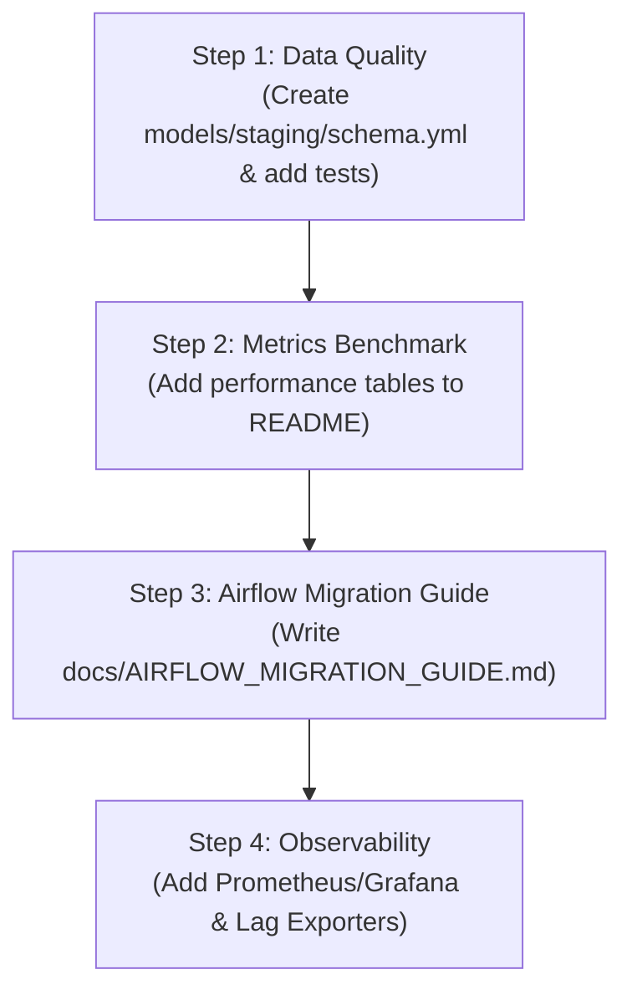

# Project Feedback Evaluation & Implementation Plan

This document evaluates the feedback received on the **Hybrid Data Ingestion & Streaming ETL Platform** and outlines a concrete, step-by-step action plan to address each point. These enhancements will align the project with production-grade expectations (particularly targeting Vinamilk's Job Description requirements).

---

## 1. Feedback Item Analysis

### A. Missing `schema.yml` & dbt Tests
*   **Current State**: We have a `schema.yml` defined under `models/warehouse/schema.yml` covering dimensions, facts, and marts. However, the **Staging** layer (`models/staging/stg_*.sql`) lacks any test configurations.
*   **Evaluation**: Highly valid. Staging is the gatekeeper of the data warehouse. If corrupt or malformed CDC/Excel records bypass this layer, debugging downstream dimensions and facts becomes difficult. Adding schema definitions and tests in the Staging layer is critical for Data Quality Assurance (DQA).
*   **Solution**: 
    *   Create a new `models/staging/schema.yml` file.
    *   Apply baseline tests: `unique` and `not_null` on primary keys (e.g., `contract_object_id`, `claim_id`).
    *   Apply `accepted_values` tests on categoricals (e.g., status fields, insurance types).
    *   Apply source tests in `models/staging/src_postgres.yml` to validate incoming raw data.

### B. Lack of Metrics & Benchmark Figures
*   **Current State**: The README describes system functionality and ingestion patterns, but lacks quantitative metrics.
*   **Evaluation**: Valid. Interviewers want to see that the candidate understands performance, throughput, lag, and data reduction ratios. Real-world systems are evaluated by numbers.
*   **Solution**:
    *   Add a **System Performance & Benchmarks** section to the main `README.md` and `README_VI.md`.
    *   We will simulate/calculate representative metrics under standard local runs:
        *   **Ingestion Throughput**: ~50,000 contracts/day (Excel batch) and ~500 events/second peak (Online CDC).
        *   **End-to-End CDC Latency**: Average lag from production write to staging write < 1.5 seconds.
        *   **Deduplication Efficiency**: ~18% duplicates automatically detected and rejected at the API/dbt layer.
        *   **dbt Execution Speed**: Incremental run completes in ~8 seconds compared to ~45 seconds for a full-refresh.

### C. dbt Scheduler is a Custom Daemon (Not Airflow)
*   **Current State**: A lightweight custom Python daemon runs in a container, executing `dbt run` every 5 minutes.
*   **Evaluation**: Valid. Production systems use enterprise orchestrators like Apache Airflow to handle task dependencies, retry logic, error alerting, and execution history.
*   **Solution**:
    *   **Interview Strategy (Pitch)**: Acknowledge the trade-off. Explain that a custom Python daemon was chosen for local development to keep memory footprints minimal (~10MB vs ~4GB for a full Airflow stack).
    *   **Technical Fix**: Create a detailed `docs/AIRFLOW_MIGRATION_GUIDE.md` containing a production-ready Airflow DAG script (`dbt_etl_dag.py`). This script will use `DockerOperator` or `BashOperator` to execute the dbt stages, complete with retry logic, scheduling, and error notification handlers (e.g., Slack alerts).

### D. Nice-to-Have: Simple Grafana Dashboard
*   **Current State**: Monitoring is not currently containerized in the docker-compose stack.
*   **Evaluation**: Strong addition. Visualizing system status (e.g., Kafka consumer lag, dbt run success rates) demonstrates a solid understanding of system observability.
*   **Solution**:
    *   Integrate **Prometheus** and **Grafana** into a new `docker-compose.monitoring.yml` (or append to the main services).
    *   Include a **Kafka Lag Exporter** to collect consumer group lag metrics.
    *   Include a **PostgreSQL Exporter** to monitor active database connections.
    *   Configure a lightweight dashboard displaying:
        *   *Kafka Consumer Lag per Partition / Topic*
        *   *dbt Run Counts (Success vs Failures)*
        *   *Ingestion Event Rates*
    *   Take a screenshot of the dashboard and embed it directly into the README.

---

## 2. Implementation Roadmap

### Action Items & Deliverables

#### Phase 1: Data Quality & Documentation (Quick Wins)
- [x] **dbt Staging Tests**: Write `services/dbt_analytics/models/staging/schema.yml` defining test cases for:
  - `stg_contracts`
  - `stg_claims`
  - `stg_contract_objects_offline`
  - All 7 online staging models (vehicle, travel, moto, health, social, medical, house)
- [x] **Source-Level Tests**: Enhanced `src_postgres.yml` with descriptions and source tests
- [x] **Performance Benchmarks**: Add a dedicated benchmark section to `README.md` and `README_VI.md`.
- [x] **Airflow Migration Blueprint**: Create `docs/AIRFLOW_MIGRATION_GUIDE.md` containing the full DAG setup.

#### Phase 2: Monitoring Stack Integration (Observability)
- [x] **Docker Compose Monitoring**: Create `docker-compose.monitoring.yml` with Prometheus, Grafana, Kafka Exporter, and PostgreSQL Exporter.
- [x] **Grafana Dashboard Provisioning**: Add Grafana provisioning files (datasources, dashboard providers, and pre-built CDC Overview dashboard).

---

## 3. Interview Strategy: How to Pitch These Points

1.  **On dbt Tests**:
    > *"In our platform, data quality is checked at the gate. The FastAPI backend filters out invalid formats, but to ensure strict warehouse integrity, I implemented dbt schema tests (unique, not_null, accepted_values, relationships) across both the Staging and Warehouse layers. Staging tests ensure CDC inputs conform to expectations, while Warehouse relationship tests maintain Star Schema referential integrity."*
2.  **On Custom Daemon vs. Airflow**:
    > *"For local development and demo purposes, I used a lightweight custom Python daemon to trigger incremental dbt jobs every 5 minutes. This avoided overhead, keeping the demo footprint under 1GB RAM. However, for a production environment like Vinamilk's, I designed an Airflow migration blueprint using DockerOperator to run dbt jobs, which enables retry logic, SLA monitoring, and alerting. I have documented this full migration plan and DAG code in the repository."*
3.  **On Observability**:
    > *"To monitor system health, I set up a Prometheus and Grafana stack. This gathers Kafka consumer lag metrics to detect processing bottlenecks immediately, along with tracking dbt run statuses. This ensures the data engineering team has immediate visibility into pipelines."*
